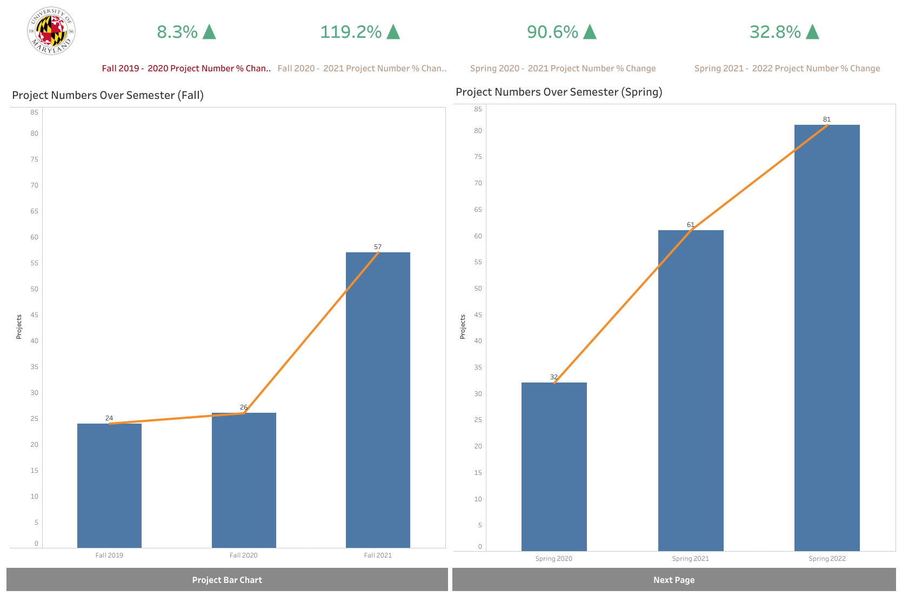
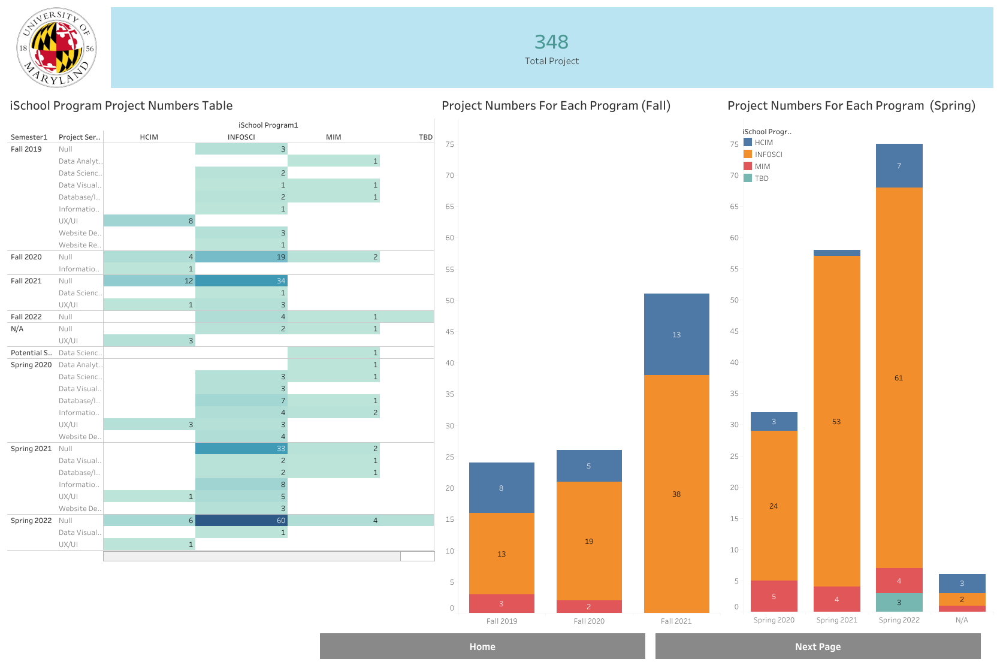
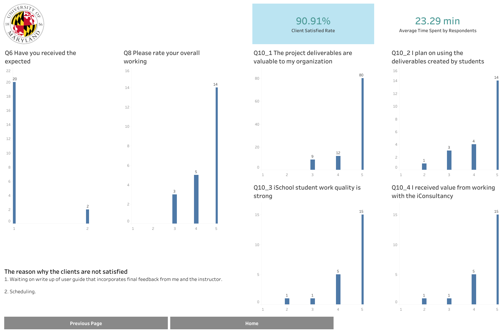

# iConsultancy_project_efficiency_analysis
## Introduction :ringed_planet:
The client, iConsultancy, organizes client-based projects to be used in capstone courses
with the UMD iSchool. This is to provide students at the UMD iSchool with professional and
real-world experience. The goals of this project are to analyze and visualize different forms of data and to ultimately give recommendations to the client, iConsultancy based on their findings.

This project will focus on analyzing survey and CRM data, with the final findings presented through a Tableau dashboard.

## Survey Data Background :crescent_moon:
The survey data is recorded by the feedback of the client who participated in the
capstone projects in Spring 2021. It includes yes/no questions, rating questions,
and some textual comments questions. Our group aimed to do some data analysis
and data visualization to show the project results and client’s attitude about their
working experience.

## Data Analysis :sunny:
All graphs below can be found in [Tableau Interactive Dashboard](https://public.tableau.com/app/profile/liyu.lo/viz/iConsultancyDashboard/Dashboard2), and all the graphs are interactive! :star2:

The dataset covers the period from Fall 2019 to Spring 2022. The objective of this analysis is to track the growth in the number of projects completed and accepted by clients over time, to showcase the progress and milestones achieved by iConsultancy to its staff and stakeholders. Given the expected seasonal patterns in the data, I have divided it into two groups to observe changes over the years.

The graph clearly shows a significant growth in the number of completed projects over time, with a particularly sharp increase between Fall 2020 and 2021, where the number of projects increased by 119%. Moreover, each semester saw an increase in the number of completed projects, demonstrating the ongoing growth of iConsultancy's project portfolio.

On this page, I have delved into the details of the iConsultancy projects and created a table and stacked bar chart. The purpose of this analysis is to enable iConsultancy to investigate the composition of the projects they have completed in each semester. By presenting the data in both tabular and graphical form, this analysis allows for a more comprehensive understanding of the distribution of project types and volumes across semesters.

The survey data page provides an overview of the client satisfaction rate with iConsultancy, as well as the specific questions answered by clients. The current satisfaction rate is close to 90.91%, indicating that the majority of clients are accepting of the final deliverables and satisfied with their overall experience. However, there is still room for improvement, and certain issues need to be addressed.

For example, some clients reported scheduling issues or communication problems with students. To improve the client experience, I suggest encouraging students to establish regular communication channels with their clients, and designating a liaison to handle communication with clients promptly and effectively.